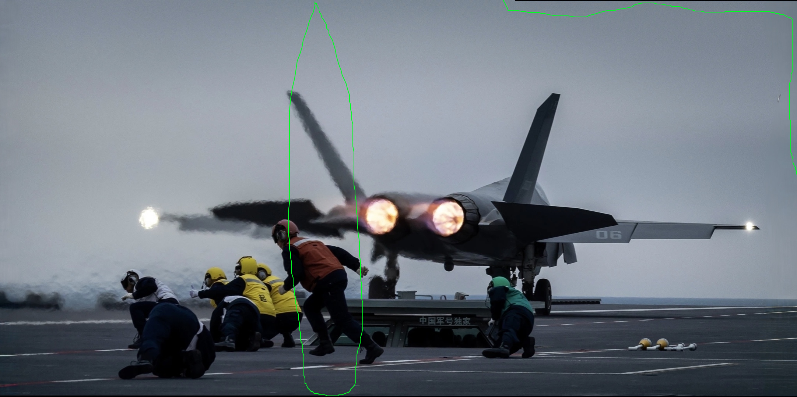
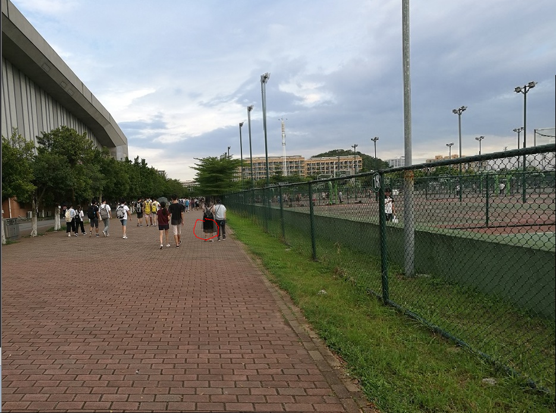
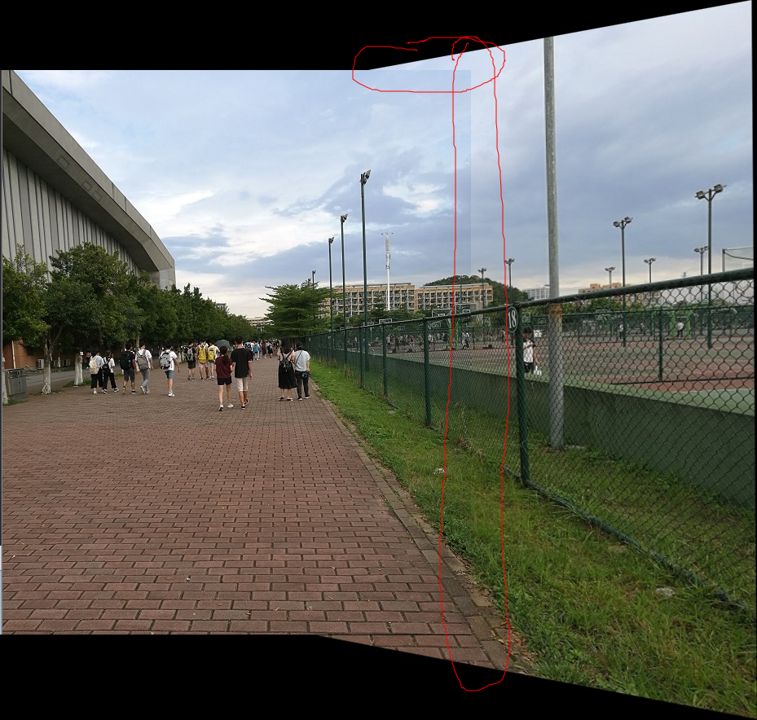
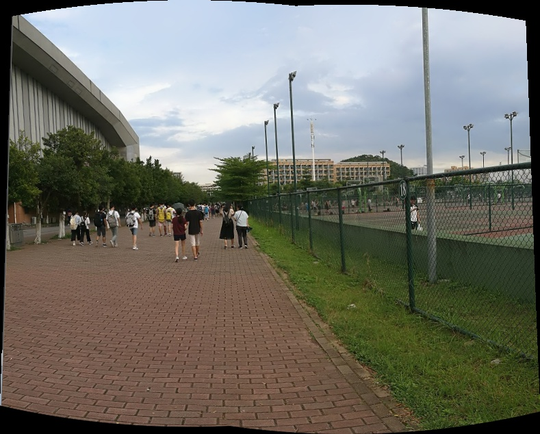

<font face="黑体" size=12><center>实验三、图像拼接</center></font>

<font face="宋体" size=4>
<b>
<!--文件头 第一行 需要改动!!!!!!!!-->
<div>
    <span style="float: left">学生姓名: 卢豪豪</span>
    <span style="float: right">指导老师: 胡政伟</span>
</div>
<center>学号: 202310310239 </center>
<br>

#### 一、实验目的

通过SIFT算法提取并匹配图像特征点，结合RANSAC算法实现图像配准与拼接，对比多种图像融合策略及图像拼接不同实现方式的差异。

#### 二、实验内容

##### 1、图像拼接一般步骤
  1. 特征匹配，对读入的两张图片进行特征点匹配。
  2. 筛选特征点对，计算单应矩阵，将两张图片放到同一个平面坐标系下。
  3. 采取相应的图像融合策略，对重叠区域进行平滑，消除拼接边界。

##### 2、输入图像
- 拼接使用的图像为 `ori_left` （左半部分）和 `ori_right_mirror` （右半部分**镜像**）。

| **Origin** | **Origin_left** |
|:----:| :----: |
|  |   |
| **Origin_right** | **Origin_right_mirror** |
|  |   |

##### 3、获取特征点
- 首先对图像进行SIFT特征提取，主要通过调用`cv2.SIFT_create()` API 实现，返回关键点（keypoints）、描述符（descriptors）。
- 这里我定义了一个`draw_pos()`函数，用于关键点的可视化。
```python
def drawpos(img_left,img_right,kps_left,kps_rigt):
    hl, wl = img_left.shape[:2]
    hr, wr = img_right.shape[:2]
    vis = np.zeros((max(hl, hr), wl + wr, 3), dtype=np.uint8)
    vis[0:hl, 0:wl] = img_left
    vis[0:hr, wl:] = img_right

    for kp in kps_left:
        pos_l = (int(kp.pt[0]),int(kp.pt[1]))
        cv2.circle(vis, pos_l, 3, (0, 0, 255), 1)
    
    for kp in kps_rigt:
        pos_r = (int(kp.pt[0]+wl),int(kp.pt[1]))
        cv2.circle(vis, pos_r, 3, (0, 255, 0), 1)
    return vis
```
- 特征点可视化结果如下图所示：


##### 4、特征匹配
- 这里我并未使用参考代码中 `FLANN` （近似最近邻库）方法，而是手动实现了`matchKeyPoint(kps_l, kps_r, features_l, features_r, ratio)`函数，实现思路就是：对每个描述子用两层循环计算欧氏距离，得到最近和次近，做 ratio 阈值测试，其实就是暴力查找。
- 虽然这种Python实现的暴力查找方法效率必然逊色于 `FLANN`，但是更加精确，这一点会在后续对比实验中进一步呈现。

```python
def matchKeyPoint(kps_l, kps_r, features_l, features_r, ratio):
    Match_idxAndDist = [] # 存储最近点位置、最近点距离、次近点位置、次近点距离
    for i in range(len(features_l)):
        # 从 features_r 中 找到与 i 距离最近的2个点
        min_IdxDis = [-1, np.inf]  # 距离最近的点,
        secMin_IdxDis = [-1 ,np.inf]  # 距离第二近的点

        for j in range(len(features_r)):
            dist = np.linalg.norm(features_l[i] - features_r[j])
            if (min_IdxDis[1] > dist):
                secMin_IdxDis = np.copy(min_IdxDis)
                min_IdxDis = [j , dist]
            elif (secMin_IdxDis[1] > dist and secMin_IdxDis[1] != min_IdxDis[1]):
                secMin_IdxDis = [j, dist]
        Match_idxAndDist.append([min_IdxDis[0], min_IdxDis[1], secMin_IdxDis[0], secMin_IdxDis[1]])
   
    
    goodMatches = []
    # 阈值测试
    # |fi-fj|/|fi-fj'|>ratio 取消匹配点
    for i in range(len(Match_idxAndDist)):
        if (Match_idxAndDist[i][1] <= Match_idxAndDist[i][3] * ratio):
            goodMatches.append((i, Match_idxAndDist[i][0]))
    
    # 获取匹配较好的点对
    goodMatches_pos = []
    for (idx, correspondingIdx) in goodMatches:
        psA = (int(kps_l[idx].pt[0]), int(kps_l[idx].pt[1]))
        psB = (int(kps_r[correspondingIdx].pt[0]), int(kps_r[correspondingIdx].pt[1]))
        goodMatches_pos.append([psA, psB])
        
    return goodMatches_pos
```

- 匹配点连线如下图所示，从图中不难看出，存在一些“假匹配点”：特征点虽然在局部描述子上相似，但实际上在空间上并不属于同一个几何变换关系。因此，需要进一步去除错误点对。


##### 5、最优单应矩阵计算
- RANSAC算法
> - RANSAC算法的基本假设是样本中包含正确数据(inliers，可以被模型描述的数据)，也包含异常数据(outliers，偏离正常范围很远、无法适应数学模型的数据)，即数据集中含有噪声。
> - 由直线的知识点可知，两点可以确定一条直线，所以可以随机的在数据点集中选择两点，从而确定一条直线。然后通过设置给定的阈值，计算在直线两旁的符合阈值范围的点，统计点的个数inliers。inliers最多的点集所在的直线，就是我们要选取的最佳直线。


参考：[图像拼接-- RANSAC 算法解析](https://cloud.tencent.com/developer/article/2096397)

- 首先定义单应矩阵的计算函数 `solve_homography()` ，如下所示：

```python
def solve_homography(P, m):
    try:
        A = []  
        for r in range(len(P)): 
            
            A.append([-P[r,0], -P[r,1], -1, 0, 0, 0, P[r,0]*m[r,0], P[r,1]*m[r,0], m[r,0]])
            A.append([0, 0, 0, -P[r,0], -P[r,1], -1, P[r,0]*m[r,1], P[r,1]*m[r,1], m[r,1]])

        u, s, vt = np.linalg.svd(A) # Solve s ystem of linear equations Ah = 0 using SVD
        # pick H from last line of vt  
        H = np.reshape(vt[8], (3,3))
        # normalization, let H[2,2] equals to 1
        H = (1/H.item(8)) * H
    except:
        print("Error on compute H")

    return H
```

- 拟合单应矩阵
基于 RANSAC 算法，定义了 `fitHomoMat(matches_pos,nIter, th)` 函数，其基本思路如下：
  1. 首先将输入的匹配点对划分为源点集与目标点集，抽样计算初始单应矩阵  `𝐻` 。
  2. 将初始矩阵 `𝐻` 于所有源点进行投影变换，计算投影位置与实际目标点间的欧氏距离。若该距离小于设定阈值 `th` ，则认为该点对为内点（`inlier`）。
  3. 迭代（`nIter`）次比较各模型内点数量，选取内点最多的模型作为最优单应矩阵。

```python
def fitHomoMat(matches_pos, nIter=1000, th=5.0)
    # 匹配点分离
    dstPoints, srcPoints = [], []
    for dstPoint, srcPoint in matches_pos:
        dstPoints.append(list(dstPoint))
        srcPoints.append(list(srcPoint))
    dstPoints, srcPoints = np.array(dstPoints), np.array(srcPoints)

    # 参数初始化
    NumSample = len(matches_pos)
    threshold = th
    NumIter = nIter
    MaxInlier = 0
    Best_H = None

    # RANSAC 迭代
    for _ in range(NumIter):
        idx = random.sample(range(NumSample), 4)
        H = solve_homography(srcPoints[idx], dstPoints[idx])

        NumInlier, pos_Inlier = 0, []
        for i in range(NumSample):
            if i in idx:
                continue
            p = np.hstack((srcPoints[i], [1]))
            q = H @ p.T
            if q[2] <= 1e-8:
                continue
            q /= q[2]
            if np.linalg.norm(q[:2] - dstPoints[i]) < threshold:
                NumInlier += 1
                pos_Inlier.append((srcPoints[i], dstPoints[i]))

        if NumInlier > MaxInlier:
            MaxInlier = NumInlier
            Best_H = H
            save_Inlier_pos = pos_Inlier

    return Best_H, save_Inlier_pos
```

- 可视化 内点（Inlier）匹配结果如下图所示。与 [初次匹配](/photos/Matches_pos.jpg) 相比， RANSAC 优化后显著提升了匹配对的准确性与鲁棒性，有效剔除了错误匹配点。


##### 6、图像融合
- 由于坐标变换等原因，导致拼接图像右侧或下方常常留有全黑区域，因此定义了 `removeBlackBorder(img)` 函数去除黑边（不过只是矩形剪切，不会将全部的黑边区域全部切掉）。主要通过像素扫描方式移除右侧与底部的纯黑像素区域，以减小图像尺寸、提高视觉紧凑度。
```python
def removeBlackBorder(img):

    h, w = img.shape[:2]
    reduced_h, reduced_w = h, w
    # 左 -> 右
    for col in range(w - 1, -1, -1):
        all_black = True
        for i in range(h):
            if (np.count_nonzero(img[i, col]) > 0):
                all_black = False
                break
        if (all_black == True):
            reduced_w = reduced_w - 1
        
    # 下 -> 上
    for row in range(h - 1, -1, -1):
        all_black = True,
        for i in range(reduced_w):
            if (np.count_nonzero(img[row, i]) > 0):
                all_black = False,
                break
        if (all_black == True):
            reduced_h = reduced_h - 1

    return img[:reduced_h, :reduced_w]
```

- 图像融合函数 `warp(img_left, img_right, H, blending_mode)` ，特别地，这里我设置了三种融合策略进行对比：
  - noBlending：直接将左图和变换后的右图叠加到拼接画布上，无任何权重混合；
  - linearBlending：对重叠区域按线性权重进行加权平均；
  - linearBlendingWithConstant：只对重叠区域的中心固定宽度部分进行线性加权，其余区域保持原像素
- 首先通过 `H` 的逆变换矩阵将右图几何变换对齐到左图坐标系，随后根据设定的融合模式执行不同的拼接策略。实现代码如下（其中 `inearBlendingWithConstantWidth()` 和 `inearBlending()` 实现代码较长，不再进行展示，[详情](./code/img_stitching.ipynb)）。
```python
def warp(img_left, img_right, HomoMat, blending_mode="linearBlending"):

    hl, wl = img_left.shape[:2]
    hr, wr = img_right.shape[:2]
    stitch_img = np.zeros((max(hl, hr), wl + wr, 3), dtype=np.uint8)

    if blending_mode == "noBlending":
        stitch_img[:hl, :wl] = img_left

    # 右图几何变换
    inv_H = np.linalg.inv(HomoMat)
    for i in range(stitch_img.shape[0]):
        for j in range(stitch_img.shape[1]):
            coor = np.array([j, i, 1])
            p = inv_H @ coor
            p /= p[2]
            y, x = int(round(p[0])), int(round(p[1]))
            if 2 <= x < hr-2 and 2 <= y < wr-2:
                stitch_img[i, j] = img_right[x, y]

    # 重叠区域融合
    if blending_mode == "linearBlending":
        stitch_img = linearBlending([img_left, stitch_img])
    elif blending_mode == "linearBlendingWithConstant":
        stitch_img = linearBlendingWithConstantWidth([img_left, stitch_img])

    # 裁剪黑边
    return removeBlackBorder(stitch_img)
```

- 三种融合策略对应效果如下图所示

| **Origin** | **描述** |
|:----:| :----: |
|  | 原图，实验图片为原图的剪切版 |
| **no Blending** | **描述** |
|  | 拼接处上下错位，过渡极为不自然 |
| **linear Blending** | **描述** |
|  | 重叠区域平滑过渡，视觉效果自然，存在不合理拉伸导致的黑边 |
| **linear Blending With Constant Width** | **描述** |
|  | 与原图相似度最高，边缘细节保持较好，未出现明显黑边。|

- 结合三种方式融合效果，可知：
  - 1️⃣ noBlending：实现最简单、速度最快；但是重叠区域可能出现明显的边界断裂或亮度突变。
  - 2️⃣ linearBlending：重叠区域实现平滑过渡，视觉效果自然，可有效减少拼接边界的明显痕迹；但是可能存在不合理拉伸，图片形状“畸形”。
  - 3️⃣ linearBlendingWithConstant：兼顾边缘细节保持和中心过渡平滑；对于重叠区域宽度较大时，能够避免整条过渡区域被拉伸导致模糊；

##### 6、对比实验
- 情景 1 ：纯静态（图片裁剪）
- 情景 2 ：微动态（重叠区域存在动态物体的移动）
- 对比手动实现、实验参考代码（将其作为 baseline ）、OpenCV `stitcher = cv2.Stitcher_create().stitch()` API 三种方式在静态拼接、微动态拼接上的差异，结果如下：

| **My_Result** | **Baseline** | **OpenCV** |
|:----:| :----: | :----: |
|  |  | 
|  |  | 

  - Baseline 在两种情景下拼接都出现了较大的问题：情景 1 图片存在不合理拉伸，情景 2 虽然并未出现“鬼影”，但是拼接“缝隙”明显；
  - 手动实现方式情景 1 表现很好，与 OpenCV API 几乎无异，可是在情景 2 中，由于人物的移动，动态物体处存在“鬼影”；
  - OpenCV API 两种情境下均表现较好。


#### 三、实验总结与探索
1、本实验手动实现了图像拼接过程，并对不同的融合策略进行了横向对比；比较了手动实现方式、实验参考代码（作为baseline）、OpenCV API 这三种方式在不同场景下的拼接效果。
2、探索
为了了解 OpenCV 内部函数是如何解决“鬼影”问题的，我查看了 OpenCV 的官方文档。

>“Seam Finding”（缝隙选择）是指在重叠区域中寻找最佳拼接路径的过程。在拼接全景图像时，不同输入图像可能存在内容差异（如物体位置、纹理或光照变化），如果直接拼接会导致重叠区域出现明显的接缝或“鬼影”。为了解决这个问题，代码中的“Seam Finding”部分通过在重叠区域计算最小可见差异路径，使最终拼接结果沿着最不显眼的缝隙连接图像，从而最大程度地减少接缝和重影。

>“Compensate exposure”（曝光补偿）是指对图像进行调整以实现曝光一致性的过程。在拼接全景图像时，不同输入图像可能具有不同的曝光水平，这可能会导致最终拼接结果中出现不连贯或明显的亮度差异。为了解决这个问题，代码中的"Compensate exposure"部分对每个图像进行曝光补偿，以使其在全景图中的曝光水平更加一致。

```cpp
// Seam finding
seam_finder_->find(img_warped, corners[img_idx], mask_warped);
LOGLN(" seam finding: " << ((getTickCount() - pt) / getTickFrequency()) << " sec");


// Compensate exposure
exposure_comp_->apply((int)img_idx, corners[img_idx], img_warped, mask_warped);
LOGLN(" compensate exposure: " << ((getTickCount() - pt) / getTickFrequency()) << " sec");
</code></pre>
</div>
```

这其实解释了为什么手动实现采用的融合方式 `linear Blending` 以及 `linear Blending With Constant Width` 均不能很好的处理“鬼影”问题：因为这两种方式是**加权平均**，重叠区域的两张照片都会起作用；但是 OpenCV 通过**缝隙选择**一张图片的像素，同时**曝光补偿**平滑亮度，从而减少鬼影。

3、其它细节这里不再详细说明，在实验内容部分已有阐述。

参考：
[1] [图像拼接-- RANSAC 算法解析](https://cloud.tencent.com/developer/article/2096397)
[2] [图像拼接与图像融合技术](https://www.cnblogs.com/skyfsm/p/7411961.html)
[3] [OpenCV : Group Stitching](https://docs.opencv.org/4.x/d1/d46/group__stitching.html)


